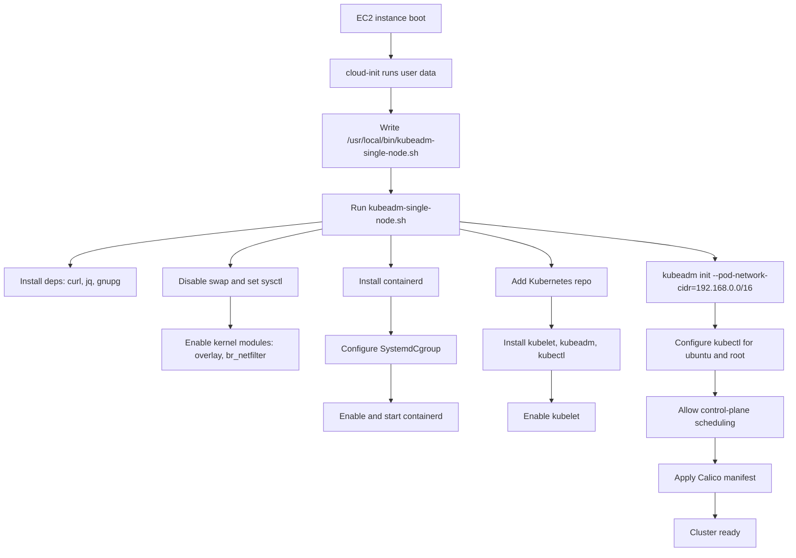

# K8s networking training

This repo contains a single-host cloud-init user data file for standing up a Kubernetes cluster with kubeadm and Calico.

## Contents

- kubeadm-userdata-single-host: Cloud-init configuration that installs containerd, kubeadm, and Calico, then initializes a single-node cluster.

## Usage (AWS EC2 user data)

1. Launch an EC2 instance and, in the **Advanced details** section, open **User data**.
2. Paste the full contents of kubeadm-userdata-single-host into the user data field.
3. Create the instance and wait for it to finish bootstrapping.
4. SSH into the instance and check status:

   ```bash
   sudo tail -n 200 /var/log/kubeadm-single-node.log
   kubectl get nodes -o wide
   kubectl get pods -A
   ```

## Diagram



## Notes

- The pod CIDR is set to 192.168.0.0/16 to match Calico defaults.
- The Kubernetes repo targets v1.29 packages from pkgs.k8s.io.
